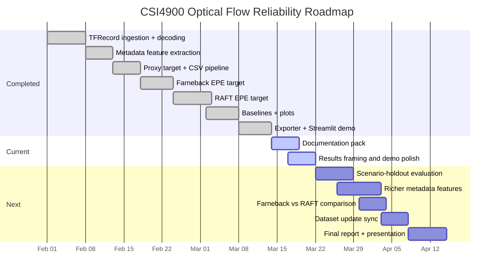

# Roadmap

This roadmap summarizes the current state of the project and what remains before final submission polish. The intention is realistic student project planning, not a polished product roadmap.

## Status

### Done
- [x] TFRecord ingestion and scenario enumeration
- [x] Ground-truth flow decoding from quantized `forward_flow`
- [x] Metadata feature extraction
- [x] Phase 1 proxy target: `reliability_score`
- [x] Phase 2 classical target: `epe_mean` using Farneback
- [x] Phase 3 modern target: `epe_mean_raft` using RAFT
- [x] Baseline regression training and saved metrics
- [x] Core report plots
- [x] Sample media exporter with RAFT flow and EPE heatmap
- [x] Streamlit demo app

### In Progress
- [ ] Repo presentation and top-level documentation polish
- [ ] Final comparison framing across proxy, Farneback, and RAFT targets
- [ ] Demo packaging for presentation day

### Next
- [ ] Scenario-holdout evaluation instead of only random row split
- [ ] Richer metadata features such as visibility, occlusion, or temporal variation
- [ ] Direct comparison of Farneback vs RAFT target difficulty
- [ ] Dataset sync with expected updated extraction
- [ ] Final report and presentation slides

## Suggested Timeline

## Why These Next Steps Matter
- Scenario-holdout evaluation is the best next validity check because it tests whether the model generalizes to unseen motion regimes, not just unseen rows.
- Richer metadata could better explain estimator failures caused by visibility, crowding, or occlusion.
- A cleaner Farneback vs RAFT comparison would make the project narrative stronger by showing how the target definition changes the learning problem.
- Dataset synchronization matters because the current local extraction is still relatively small, which limits confidence in the conclusions.
