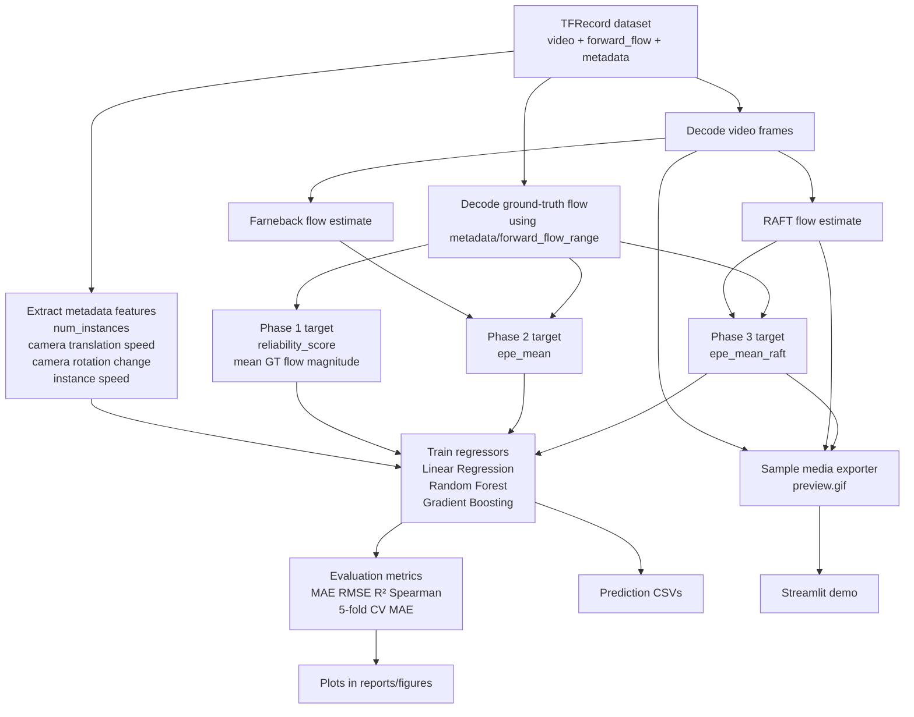
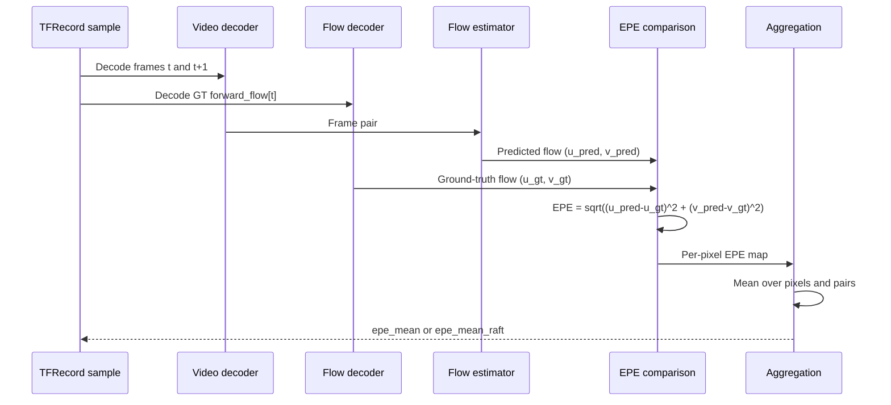

# Workflow

This page is the quick project map for the CSI4900 optical-flow reliability repo. The goal is to predict how hard optical flow estimation will be from lightweight motion metadata, without running a heavy estimator at deployment time.

## End-to-End Pipeline

This diagram shows the full repository flow. We start from TFRecords, decode both the video frames and the quantized ground-truth flow, extract compact metadata features, define three reliability targets, train regression baselines, then surface the results through figures, exported media, and the Streamlit demo.

## EPE Computation Focus

This second diagram zooms in on how error labels are created. For each frame pair, we estimate flow, compare it to the decoded ground-truth flow, compute the End-Point Error at each pixel, and average the result to produce the label used for model training.

## Where Things Live
- `src/build_all_tables.py`: Phase 1 proxy target builder
- `src/build_all_tables_epe.py`: Farneback EPE table builder
- `src/build_all_tables_raft_epe.py`: RAFT EPE table builder
- `src/train_regressor.py`: baseline training and evaluation
- `src/plots.py`: report figure generation
- `tools/export_sample_media.py`: GIF + RAFT visual export for one sample
- `streamlit_app.py`: interactive demo layer

## Dataset Note
- Local dataset root used in this repo: `/Users/seifeddinereguige/Documents/tfds_Dataset`
- The raw dataset is not tracked in git
- Generated outputs are written to `outputs/`, which is git-ignored
